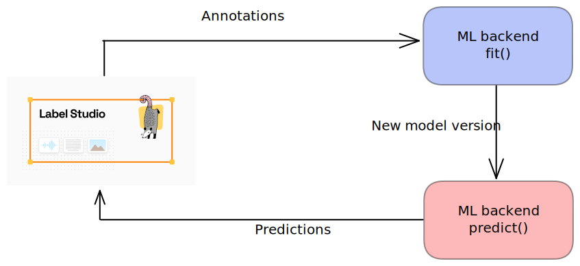

## Installation

[Installlation link](https://labelstud.io/guide/install.html)

### Installation with pip

```bash
pip install label-studio
```
### Starting label studio
```bash
label-studio start
```
Label studio demo:
- Overview of label-studio (creating a new project)
- Loading data into Label studio
- Labelling Interface
- Annotations
- Exporting Annotations

Labelling Configuration for Text Classification
```xml
<View>
    <Header value="$doc_name"/>
    <Text name="text" value="$content"/>
    <Choices name="label" toName="text" choice="multiple" showInLine="true">
      <Choice value="Label 1"/>
      <Choice value="Label 2"/>
      <Choice value="Label 3"/>
    </Choices>
 </View>
```

Labelling Configuration for NER
```xml
<View>
  <Header value="$doc_name"/>
  <Labels name="label" toName="text"> 
  <Label value="CARDINAL" background="#FFA39E"/><Label value="DATE" background="#D4380D"/>
<Label value="EVENT" background="#FFC069"/>
<Label value="FAC" background="#AD8B00"/>
<Label value="GPE" background="#D3F261"/>
<Label value="LANGUAGE" background="#389E0D"/>
<Label value="LAW" background="#5CDBD3"/>
<Label value="LOC" background="#096DD9"/>
<Label value="MONEY" background="#ADC6FF"/>
<Label value="NORP" background="#9254DE"/>
<Label value="ORDINAL" background="#F759AB"/>
<Label value="ORG" background="#FFA39E"/>
<Label value="PERCENT" background="#D4380D"/>
<Label value="PERSON" background="#FFC069"/>
<Label value="PRODUCT" background="#AD8B00"/>
<Label value="QUANTITY" background="#D3F261"/>
<Label value="TIME" background="#389E0D"/>
<Label value="WORK_OF_ART" background="#5CDBD3"/></Labels>

<Text name="text" value="$content"/>
</View>
```


## Label Studio ML backend

## What is the Label Studio ML backend?

Reference: https://github.com/heartexlabs/label-studio-ml-backend

The Label Studio ML backend is an SDK that lets you wrap your machine learning code and turn it into a web server. You can then connect that server to a Label Studio instance to perform 2 tasks:

-   Dynamically pre-annotate data based on model inference results
-   Retrain or fine-tune a model based on recently annotated data

Installation:
```bash
pip install label-studio-ml
```

ML-backend demo:
- Retrive predictions from the ML-model 
- Retrain/finetune the model 

